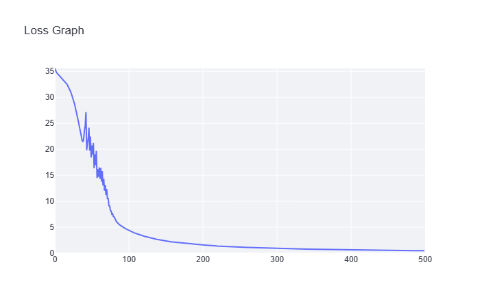

[](https://classroom.github.com/a/YFgwt0yY)
# MiniTorch Module 2


* Docs: https://minitorch.github.io/

* Overview: https://minitorch.github.io/module2/module2/

This assignment requires the following files from the previous assignments. You can get these by running

```bash
python sync_previous_module.py previous-module-dir current-module-dir
```

The files that will be synced are:

        minitorch/operators.py minitorch/module.py minitorch/autodiff.py minitorch/scalar.py minitorch/scalar_functions.py minitorch/module.py project/run_manual.py project/run_scalar.py project/datasets.py
		
## Module 2 Task 2.5: Visualization
-------------
### Simple

#### Hyperparameters:
PTS = 50
HIDDEN = 2
RATE = 0.1
EPOCHS = 500

#### Plots:



#### Terminal Output:
```
Epoch: 0/500, loss: 0, correct: 0
Epoch: 10/500, loss: 33.76100208224575, correct: 27
Epoch: 20/500, loss: 31.817449120451066, correct: 27
Epoch: 30/500, loss: 27.25490005657772, correct: 37
Epoch: 40/500, loss: 22.138735735170382, correct: 35
Epoch: 50/500, loss: 18.42465133929101, correct: 39
Epoch: 60/500, loss: 14.688928893578787, correct: 43
Epoch: 70/500, loss: 11.20060976522112, correct: 46
Epoch: 80/500, loss: 7.047778069532844, correct: 49
Epoch: 90/500, loss: 5.300779978284516, correct: 49
Epoch: 100/500, loss: 4.4530048653552425, correct: 50
Epoch: 110/500, loss: 3.8273435901367168, correct: 50
Epoch: 120/500, loss: 3.342429743713707, correct: 50
Epoch: 130/500, loss: 2.95655773247077, correct: 50
Epoch: 140/500, loss: 2.6431725461010163, correct: 50
Epoch: 150/500, loss: 2.384369111150182, correct: 50
Epoch: 160/500, loss: 2.1676625468395585, correct: 50
Epoch: 170/500, loss: 2.0224435806878716, correct: 50
Epoch: 180/500, loss: 1.8672848133956435, correct: 50
Epoch: 190/500, loss: 1.730152193065034, correct: 50
Epoch: 200/500, loss: 1.6096351845845565, correct: 50
Epoch: 210/500, loss: 1.5032923582591722, correct: 50
Epoch: 220/500, loss: 1.3920308828995127, correct: 50
Epoch: 230/500, loss: 1.3111043012476609, correct: 50
Epoch: 240/500, loss: 1.2398608306065737, correct: 50
Epoch: 250/500, loss: 1.1755563976689873, correct: 50
Epoch: 260/500, loss: 1.1171255991510964, correct: 50
Epoch: 270/500, loss: 1.0637813604549227, correct: 50
Epoch: 280/500, loss: 1.0148916033051374, correct: 50
Epoch: 290/500, loss: 0.9699304982504446, correct: 50
Epoch: 300/500, loss: 0.9284532985898699, correct: 50
Epoch: 310/500, loss: 0.8900801573095214, correct: 50
Epoch: 320/500, loss: 0.8544843457517584, correct: 50
Epoch: 330/500, loss: 0.8213831610473427, correct: 50
Epoch: 340/500, loss: 0.7905307108322086, correct: 50
Epoch: 350/500, loss: 0.7617122356937155, correct: 50
Epoch: 360/500, loss: 0.7347389615082525, correct: 50
Epoch: 370/500, loss: 0.7094445803952122, correct: 50
Epoch: 380/500, loss: 0.6856820056560773, correct: 50
Epoch: 390/500, loss: 0.6633206337333519, correct: 50
Epoch: 400/500, loss: 0.6422441074919828, correct: 50
Epoch: 410/500, loss: 0.6223484757642578, correct: 50
Epoch: 420/500, loss: 0.6035404864981577, correct: 50
Epoch: 430/500, loss: 0.5857363158552318, correct: 50
Epoch: 440/500, loss: 0.5688604364449501, correct: 50
Epoch: 450/500, loss: 0.5528445988053755, correct: 50
Epoch: 460/500, loss: 0.5376269812853804, correct: 50
Epoch: 470/500, loss: 0.523151456001275, correct: 50
Epoch: 480/500, loss: 0.5093669529509822, correct: 50
Epoch: 490/500, loss: 0.4962269071088782, correct: 50
Epoch: 500/500, loss: 0.48368877627192086, correct: 50
```
-------------
### Diag

#### Hyperparameters:
PTS = 50
HIDDEN = 2
RATE = 0.5
EPOCHS = 500

#### Plots:


#### Terminal Output:
```
Epoch: 0/500, loss: 0, correct: 0
Epoch: 10/500, loss: 16.160649653465935, correct: 46
Epoch: 20/500, loss: 14.525460362603113, correct: 46
Epoch: 30/500, loss: 14.124566198903842, correct: 46
Epoch: 40/500, loss: 13.996630949283514, correct: 46
Epoch: 50/500, loss: 13.950741127207646, correct: 46
Epoch: 60/500, loss: 13.9326750033577, correct: 46
Epoch: 70/500, loss: 13.924307685660944, correct: 46
Epoch: 80/500, loss: 13.919069798555189, correct: 46
Epoch: 90/500, loss: 13.914426398196106, correct: 46
Epoch: 100/500, loss: 13.909028757903757, correct: 46
Epoch: 110/500, loss: 13.902352957366105, correct: 46
Epoch: 120/500, loss: 13.893965579163162, correct: 46
Epoch: 130/500, loss: 13.882620442191477, correct: 46
Epoch: 140/500, loss: 13.866454003497418, correct: 46
Epoch: 150/500, loss: 13.841342067624453, correct: 46
Epoch: 160/500, loss: 13.799157886073806, correct: 46
Epoch: 170/500, loss: 13.730226683660943, correct: 46
Epoch: 180/500, loss: 13.614786026151997, correct: 46
Epoch: 190/500, loss: 13.399716096024191, correct: 46
Epoch: 200/500, loss: 13.051158938400592, correct: 46
Epoch: 210/500, loss: 12.521817542959367, correct: 46
Epoch: 220/500, loss: 11.83720782564516, correct: 46
Epoch: 230/500, loss: 10.99158822806107, correct: 46
Epoch: 240/500, loss: 9.974209342446414, correct: 46
Epoch: 250/500, loss: 9.127379303017738, correct: 46
Epoch: 260/500, loss: 8.346168333298204, correct: 46
Epoch: 270/500, loss: 7.624770391333618, correct: 46
Epoch: 280/500, loss: 6.971961653647697, correct: 46
Epoch: 290/500, loss: 6.359080025725624, correct: 46
Epoch: 300/500, loss: 5.81580769432201, correct: 46
Epoch: 310/500, loss: 5.319024508821749, correct: 46
Epoch: 320/500, loss: 4.879261059951233, correct: 46
Epoch: 330/500, loss: 4.4882456050265445, correct: 46
Epoch: 340/500, loss: 4.135763802759184, correct: 49
Epoch: 350/500, loss: 3.8249769900058075, correct: 49
Epoch: 360/500, loss: 3.5494555130012526, correct: 49
Epoch: 370/500, loss: 3.3084606260542917, correct: 49
Epoch: 380/500, loss: 3.087156782661675, correct: 49
Epoch: 390/500, loss: 2.8933378544717825, correct: 49
Epoch: 400/500, loss: 2.7202826644562834, correct: 49
Epoch: 410/500, loss: 2.565107745347662, correct: 49
Epoch: 420/500, loss: 2.425329887229256, correct: 49
Epoch: 430/500, loss: 2.29882652768099, correct: 49
Epoch: 440/500, loss: 2.183793290404988, correct: 49
Epoch: 450/500, loss: 2.0787019928316073, correct: 49
Epoch: 460/500, loss: 1.9822612141803626, correct: 49
Epoch: 470/500, loss: 1.8933805833632913, correct: 50
Epoch: 480/500, loss: 1.811139270607509, correct: 50
Epoch: 490/500, loss: 1.7347587137651748, correct: 50
Epoch: 500/500, loss: 1.663579336115285, correct: 50
```
-------------
### Split

#### Hyperparameters:
PTS = 50
HIDDEN = 10
RATE = 0.5
EPOCHS = 1000

#### Plots:


#### Terminal Output:
```

```
-------------
### XOR

#### Hyperparameters:
PTS = 50
HIDDEN = 10
RATE = 0.5
EPOCHS = 500

#### Plots:


#### Terminal Output:
```
Epoch: 0/500, loss: 0, correct: 0
Epoch: 10/500, loss: 32.72163920370223, correct: 29
Epoch: 20/500, loss: 31.97795360665304, correct: 35
Epoch: 30/500, loss: 31.610292157073573, correct: 37
Epoch: 40/500, loss: 30.589208040559406, correct: 37
Epoch: 50/500, loss: 29.45929130486396, correct: 37
Epoch: 60/500, loss: 32.200136293965976, correct: 31
Epoch: 70/500, loss: 28.006152339534317, correct: 37
Epoch: 80/500, loss: 26.20607633839755, correct: 38
Epoch: 90/500, loss: 24.963078946698104, correct: 37
Epoch: 100/500, loss: 23.689696342798843, correct: 41
Epoch: 110/500, loss: 22.627926268842046, correct: 41
Epoch: 120/500, loss: 29.054575972498405, correct: 32
Epoch: 130/500, loss: 27.15246684085445, correct: 33
Epoch: 140/500, loss: 21.691017454991524, correct: 41
Epoch: 150/500, loss: 17.470978703577433, correct: 43
Epoch: 160/500, loss: 16.963899204366033, correct: 43
Epoch: 170/500, loss: 19.017761486275862, correct: 41
Epoch: 180/500, loss: 14.983184721648325, correct: 41
Epoch: 190/500, loss: 12.61434938738803, correct: 43
Epoch: 200/500, loss: 16.686082678208095, correct: 41
Epoch: 210/500, loss: 10.813786474134872, correct: 45
Epoch: 220/500, loss: 14.299747618372447, correct: 41
Epoch: 230/500, loss: 10.431083520350827, correct: 44
Epoch: 240/500, loss: 8.301583005235965, correct: 48
Epoch: 250/500, loss: 15.35108454502761, correct: 41
Epoch: 260/500, loss: 7.0543921320841765, correct: 49
Epoch: 270/500, loss: 5.804366369297787, correct: 50
Epoch: 280/500, loss: 15.704243994044901, correct: 40
Epoch: 290/500, loss: 4.6931368914687, correct: 50
Epoch: 300/500, loss: 4.16184558429979, correct: 50
Epoch: 310/500, loss: 4.139960566115951, correct: 50
Epoch: 320/500, loss: 12.732777296420958, correct: 42
Epoch: 330/500, loss: 3.7652011951484163, correct: 50
Epoch: 340/500, loss: 3.207477566440242, correct: 49
Epoch: 350/500, loss: 2.84616163815701, correct: 49
Epoch: 360/500, loss: 2.7535231665192907, correct: 49
Epoch: 370/500, loss: 2.773579978862159, correct: 49
Epoch: 380/500, loss: 3.764690520478252, correct: 49
Epoch: 390/500, loss: 23.271485410967873, correct: 40
Epoch: 400/500, loss: 2.0899550202966592, correct: 50
Epoch: 410/500, loss: 1.8492236133386561, correct: 50
Epoch: 420/500, loss: 1.7493895135765813, correct: 50
Epoch: 430/500, loss: 1.876270864386779, correct: 50
Epoch: 440/500, loss: 1.8037956245777533, correct: 50
Epoch: 450/500, loss: 1.4399083748934174, correct: 50
Epoch: 460/500, loss: 1.3343960586622645, correct: 50
Epoch: 470/500, loss: 1.5278244160677672, correct: 50
Epoch: 480/500, loss: 1.2406167387600948, correct: 50
Epoch: 490/500, loss: 1.0656090938003737, correct: 50
Epoch: 500/500, loss: 1.0621545340633807, correct: 50
```
-------------